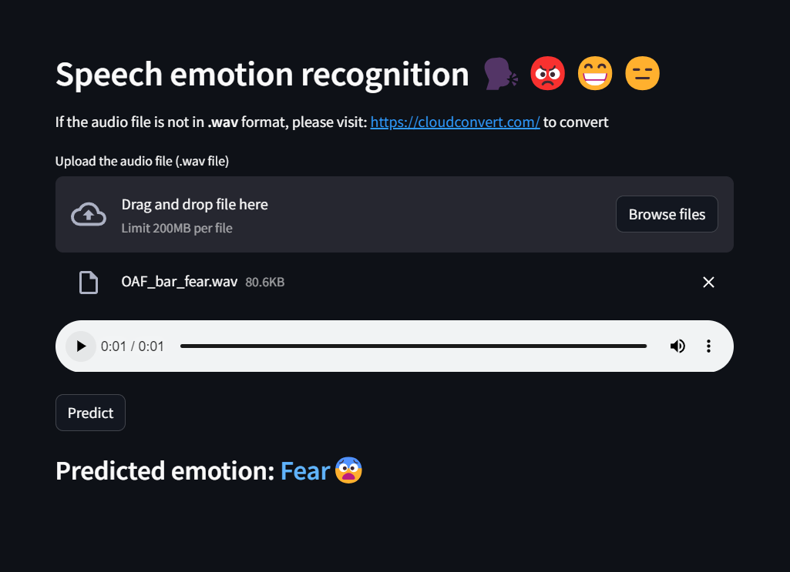

# Speech Emotion Recognition (TESS + RAVDESS)🗣️😡😨😆

This repository contains code for a Speech Emotion Recognition (SER) model capable of classifying 7 emotions, including `happy`, `sad`, `angry`, `fear`, `disgust`, `neutral`, and `surprised`. The model uses **Mel-Frequency Cepstral Coefficients (MFCC)** for sound feature extraction, along with the **Toronto emotional speech set (TESS)** and **Ryerson Audio-Visual Database of Emotional Speech and Song (RAVDESS)** datasets. It employs various Machine Learning (ML)(Random Forest, XGBoost, CatBoost, Gradient Boosting, etc.) and Deep Learning (DL) approaches(Dense, GRU, LSTM), with a Dense Model achieving the highest accuracy of approximately **90%**. The project showcases the integration of ML and DL techniques for accurate emotion recognition from speech signals.
    
To clone my repository:
```
git clone https://github.com/Mainakcris7/speech_emotion_recognition_with_tess_ravdess.git
```

To execute the streamlit app:
```
python -m streamlit run speech_emotion.py
```
or
```
streamlit run speech_emotion.py
```


## 🚀 About Me
👋 Hi there! I'm **Mainak Mukherjee**, a passionate and ambitious B.Tech student with a strong drive to become a Data Scientist and Data Analyst. Welcome to my data-driven journey!


## Python Libraries used

- numpy
- matplotlib
- seaborn
- tensorflow
- librosa
- IPython
- xgboost
- lightgbm
- catboost
- streamlit
- random
- joblib
- os


## Link for the datasets

[TESS](https://www.kaggle.com/datasets/ejlok1/toronto-emotional-speech-set-tess)

[RAVDESS](https://www.kaggle.com/datasets/uwrfkaggler/ravdess-emotional-speech-audio/data)


## Author

- [@Mainakcris7](https://github.com/Mainakcris7)

## Feedback

If you have any feedback, please reach out to me at mainakcr72002@gmail.com
